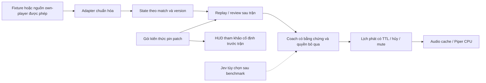

# Đánh giá TFT AI Voice Coach và hướng phát triển Windows

Ngày kiểm tra: 23/09/2026, Asia/Ho_Chi_Minh. Code baseline: `86cd906`, branch `main`.

## 1. Kết luận và ý định của chủ dự án

Bạn muốn một người nhắc bài bằng tiếng Việt, tự hiểu bối cảnh TFT, nói ngắn vào đúng thời điểm và có HUD để giảm tải mắt/tay. Người chơi không cần micro; ứng dụng không thao tác game thay người chơi. Bạn xác nhận ưu tiên **dùng cá nhân, ổn định, nhắc ít nhưng đúng**.

Máy đích do bạn cung cấp: **Windows 11, Intel i5-12400F, RAM 16 GB, RTX 2060 6 GB, CUDA 13.1**. CUDA là thông tin bạn báo, chưa kiểm tra driver/toolkit. Phiên này chỉ khảo sát trên macOS; chưa kết nối, cài hay chạy trên Windows.

Ý tưởng có giá trị trải nghiệm, nhưng repo hiện là **prototype luồng advisor bằng mock**, chưa phải ứng dụng coach đã tích hợp. Điểm khó nhất không phải dựng HUD hoặc gọi TTS: đó là phạm vi được phép, dữ liệu đúng, kiến thức đúng patch, và biết khi nào phải im lặng.

**Khuyến nghị:** giữ tầm nhìn coach chủ động làm nhánh nghiên cứu có điều kiện; bản dùng cá nhân đầu tiên tập trung nền Windows đáng tin, kế hoạch trước trận, HUD tham khảo cố định và review bằng giọng nói sau trận. Đây là đề xuất điều chỉnh lộ trình, **chưa phải xác nhận của bạn rằng đồng ý thay đổi mục tiêu live coach**.

Đọc [roadmap tổng](../plan.md) và từng phase để triển khai sau khi chọn phạm vi. Chưa sửa mã ứng dụng trong phiên đánh giá này.

## 2. Hiện trạng đối chiếu với README

| Thành phần | Đã có | Khoảng cách thực tế |
|---|---|---|
| Overwolf | Manifest, background window, đăng ký events | Chưa chứng minh load Windows; parser không khớp dữ liệu tài liệu; vòng đời listener có lỗi |
| State | stage/gold/hp/level và các mảng mẫu | Không cập nhật board/streak; chưa quản lý match, freshness, patch và nguồn dữ liệu |
| Advisors | Economy, augment, item, shop tách file | Luật mẫu, comp cố định, giả định thiếu; không có kiểm chứng chất lượng chiến thuật |
| Jev | Lớp client + nhánh fallback | Dependency và API gọi không khớp SDK đã kiểm tra; browser chưa tích hợp |
| Voice | Thử HTTP rồi Web Speech | Không có dịch vụ TTS trong repo; queue/priority chưa hoạt động; chưa đo âm thanh |
| HUD | HTML/CSS/card/glow | IPC sai contract; khung augment cố định giữa màn hình; shop highlight chưa xử lý |
| Meta | Mô tả trong README | Không có crawler, dữ liệu patch, nguồn win rate hay provenance |
| Kiểm thử | 1 script mock | Không assertion, bỏ qua background/parser, Overwolf, DOM và playback thật |
| Phát hành | Chỉ dẫn load unpacked | Chưa có lockfile, installer/runbook Windows, health check hay rollback |

## 3. Vấn đề ưu tiên có bằng chứng

Đường dẫn dưới đây tính từ gốc repository.

| Mức | Vấn đề và tác động | Bằng chứng |
|---|---|---|
| P0 | Phạm vi live thích nghi chưa phù hợp để coi là sẵn sàng triển khai; cam kết an toàn 100% không có cơ sở | README §1; lời chỉ dẫn trong `src/advisors/augmentAdvisor.js:21`, `economyAdvisor.js:25`, `shopAdvisor.js:28`; nguồn S1–S2 |
| P1 | `^0.1.0` không khớp các phiên bản SDK công bố; đường cài dependency chưa hợp lệ | `package.json:22`; npm metadata kiểm tra trong phiên |
| P1 | Nhánh Jev dùng API khác SDK; gọi `require()` từ script browser không có bundler/module loader; catch che lỗi bằng heuristic | `src/ai/jevClient.js:32`, `:75`, `:113`; `src/background/background.html:9`; nguồn S4 |
| P1 | Không có adapter đúng schema GEP: coi store/bench/augments là mảng trực tiếp, không decode đúng round context | `src/background/background.js:147–187`; nguồn S2 |
| P1 | Economy chạy trước khi merge gold/level/hp, sau đó khóa cả round; số 0 bị bỏ qua | `src/background/background.js:148–154`; `src/advisors/economyAdvisor.js:15–16` |
| P1 | Đăng ký nhiều lần, hủy bằng function mới do `.bind()`; có thể nhân bản advice và retry còn sống sau khi game dừng | `src/background/background.js:70–85`, `:121–138` |
| P1 | Gửi HUD chỉ 3 tham số trong khi API có message ID và content riêng | `src/background/background.js:116`; `src/overlay/overlay.js:12–14`; nguồn S3 |
| P1 | Queue và priority chưa điều phối; nhiều Piper playback có thể chồng, Web Speech tự hủy câu trước | `src/voice/voiceEngine.js:16–17`, `:23–40`, `:59–60`, `:75` |
| P1 | Advice có thể đến muộn sau đổi shop/vòng/trận; thiếu timeout AI, snapshot, TTL, cancellation và kiểm tra state version | `src/advisors/augmentAdvisor.js:17–35`, `itemAdvisor.js:51–68`; background giữ mutable state |
| P1 | Confidence giả thành chất lượng: mock chọn lõi đầu nhưng nói “tỷ lệ thắng cao nhất”; xác suất heuristic không phải win rate | `src/ai/jevClient.js:95–98`; `src/advisors/augmentAdvisor.js:21`; `economyAdvisor.js:26` |
| P2 | Highlight không dựa trên slot: tên augment không dùng, shop action không có handler; vị trí 1920×1080 cố định | `src/overlay/overlay.js:22–37`, `:72–77`; `manifest.json:30–33` |
| P2 | Mở rộng dữ liệu/API sẽ đưa dữ liệu ngoài vào HTML; cần text node/validation trước đó | `src/overlay/overlay.js:43–46`; hiện chưa chứng minh exploit từ nguồn thật |

Không gộp các lỗi riêng lẻ này thành lý do viết lại toàn bộ app. Giữ phân lớp hiện có; sửa contract và vòng đời trước, bổ sung seam kiểm thử vừa đủ.

## 4. Đối chiếu nền tảng và giới hạn sản phẩm

### Riot và Overwolf

Riot nêu rõ hạn chế gợi ý thích nghi theo trạng thái trận và chỉ dẫn quyết định tức thời; tài liệu khuyến khích học trước/sau trận. Overwolf cảnh báo riêng không hỗ trợ/hiển thị dữ liệu augment. Hai nguồn không nên bị diễn giải thành mọi dạng thống kê augment đều đồng nghĩa nhau. [S1][S2]

Hệ quả thiết kế do đánh giá này đề xuất: lập bảng feature được dùng/chưa rõ/không bật; tắt đường augment live; không bật lời nhắc shop, lên cấp, ghép đồ từ state thật trước khi phạm vi cụ thể được làm rõ với nền tảng. “Dùng cá nhân”, “không click tự động”, “qua SDK”, “custom game” không phải bằng chứng miễn trừ. Không liên hệ/gửi đăng ký thay bạn trong phiên này.

Native TFT dùng chung game ID với LoL; `21570` là ID kiểm tra trạng thái TFT riêng, không thay mọi `5426`. Native schema có `round_type`, `store.shop_pieces`, `bench_pieces`, `item_bench`; phải capture/kiểm tra contract đúng runtime. [S2]

Giữ Overwolf Native để tận dụng repo, nhưng gate đầu tiên phải chứng minh có quyền và đường load unpacked hoạt động trên Windows. Tauri/Electron không tự giải quyết việc thiếu dữ liệu trận hay phạm vi được phép.

### Jev / TypeSafe

Registry trả các bản `0.0.0-bootstrap.0`, `0.5.7`, `0.6.0`; không bản nào thỏa `^0.1.0`. SDK công khai dùng `systemOne({state, questions})`, `choice()/noul()` và `answers`; mặc định hạn chế browser. [S4][S5]

Vì thế, chưa nên sửa version rồi coi tích hợp đã xong. Cần pin phiên bản, contract test, quyết định nơi giữ key và kiểm tra đúng kiểu response. Không bật tùy chọn cho phép browser chỉ để bỏ qua lỗi.

Nhận định kỹ thuật: schema đúng chỉ giảm lỗi định dạng; không chứng minh Jev hiểu TFT, biết patch hiện tại, tối ưu chiến thuật hoặc có xác suất hiệu chuẩn. Giữ rule kiểm tra tính hợp lệ và nhãn nguồn. Jev phải thắng baseline trên tập tình huống đã chấm mới đáng thêm vào đường xử lý. Bạn chưa xác nhận Jev bắt buộc; roadmap coi Jev là tùy chọn và không cần API trả phí để hoàn thành MVP.

### Giọng nói tiếng Việt

Piper cũ đã archive; nhánh hiện hành là OHF-Voice/piper1-gpl. HTTP hiện dùng POST `/synthesize` với JSON và trả WAV, khác GET `/tts` của repo. Voice được tìm thấy là `vi_VN-vivos-x_low.onnx`, không phải `vivos-low`. Có wheel Windows x64 trên PyPI, chưa phải bằng chứng chạy trên máy bạn. [S6–S9]

Chọn CPU làm baseline để không giành VRAM với TFT. Ưu tiên audio cache cho câu cố định; chỉ bổ sung một tiến trình Piper local nếu cần câu động. Kiểm tra phát âm 20 câu tiếng Việt/tên tướng bằng tai nghe thật. Web Speech chỉ là fallback nếu runtime tìm thấy voice phù hợp, không giả định Windows có sẵn.

Engine hiện GPL-3.0; model card ghi dataset CC BY-NC-SA 4.0. Ghi provenance từng thành phần, đánh giá quyền model cụ thể trước phân phối; không suy từ nhãn MIT của app sang mọi dependency. [S6][S8]

### Meta và độ trễ

Không có nguồn nào trong repo cung cấp win rate. Data Dragon là tài nguyên/dữ liệu tĩnh; nó không thay thế tập dữ liệu hiệu quả chiến thuật. Bản đầu dùng một gói JSON được kiểm tra thủ công, có set/patch/nguồn/ngày cập nhật. Crawler Tactics.tools/MetaTFT chỉ cân nhắc khi xác minh quyền truy cập và nhu cầu thực sự. [S1]

Các con số README chưa được benchmark. Đặt mục tiêu thử nghiệm riêng: audio cache p95 ≤250 ms và TTS nóng p95 ≤1 s từ lúc cho phép phát đến tiếng đầu tiên; ghi riêng thời gian lấy event, quyết định và hàng đợi. Đồng thời ghi E2E từ lúc nhận event đến tiếng đầu tiên, kể cả chờ quyết định/queue; báo riêng cold/warm/cache hit và câu bị hủy. Đối chiếu mốc playback bằng thu loopback hoặc đo âm thanh trên Windows. Đây là mục tiêu để đo/tinh chỉnh, không cam kết phần cứng. Không gọi thời gian HTTP response là độ trễ nghe được hoặc dùng chỉ số allow-play để thay E2E.

## 5. Ba hướng và lựa chọn đề xuất

| Hướng | Điểm được | Cái giá / điều kiện | Đánh giá |
|---|---|---|---|
| A. Hoàn thiện live coach đúng README ngay | Gần nhất tầm nhìn tự nhắc | Vướng phạm vi nền tảng, data/API chưa đúng, chưa có chiến thuật đủ tin cậy | Chưa phù hợp làm bản dùng thật đầu tiên |
| B. Nền Windows + học trước/sau trận; live là nhánh có điều kiện | Giữ tiếng Việt, cá nhân hóa và phần nền tái sử dụng; đo được chất lượng | Chưa cung cấp toàn bộ lời nhắc live như mong muốn ban đầu | **Đề xuất ưu tiên** |
| C. Viết lại standalone + OCR + local model GPU | Ít phụ thuộc shell Overwolf | Tăng bài toán OCR, DPI, model, GPU; không giải quyết phạm vi nền tảng | Hoãn; chỉ xét khi có bằng chứng Overwolf không phù hợp |

Không mở rộng microphone, RAG/vector DB, đa agent runtime, cloud backend, dashboard thương mại hay auto-play. Các thứ này không giúp xác minh “nhắc ít nhưng đúng” ở giai đoạn hiện tại.

## 6. Kiến trúc đề xuất và biên dữ liệu

Đây là thiết kế đề xuất, chưa tồn tại trong code. MVP giữ JS hiện có; tách xử lý state khỏi Overwolf để test bằng Node. Thêm một desktop window tối giản cho pregame/settings/postgame vì overlay hiện chỉ chạy trong game. Trước cleanup live, finalize completedSession immutable; review dùng generation riêng và dừng phát nếu có trận mới. Chỉ thêm sidecar khi có nhu cầu TTS động/giữ credential. Một launcher có thể quản lý cả hai sau này; Piper và adapter Jev có thể là các runtime/process khác nhau, phải đo tổng tài nguyên và dừng toàn bộ process tree.

Contract tối thiểu cần có:

- State: `matchId`, `revision`, `observedAt`, `source`, `patch`, `mode`, trường chưa biết là `null`; freshness theo từng trường. Replay cũng dùng contract này.
- Advice: `id`, `mode`, `stateRevision`, `reason`, `evidenceRefs`, `source`, `dedupeKey`, `expiresAt`; chỉ publish nếu còn đúng match/mode/revision và điều kiện liên quan còn hợp lệ.
- Pipeline thu dữ liệu chỉ lấy trường own-player cần thiết và đã xác nhận được phép; loại dữ liệu đối thủ trước khi ghi log/gửi engine. Nếu nguồn không tách được hoặc quyền chưa rõ, dùng fixture tổng hợp.
- In-game mặc định chỉ HUD tĩnh, voice chiến thuật tắt. Người dùng có thể bật một lần cài đặt tự review sau trận để giữ hands-free; chỉ bắt đầu khi xác nhận kết thúc trận, không phát giữa trận tiếp theo, luôn có hotkey mute.
- Nếu chỉ có match summary, review giới hạn ở summary. Không suy diễn lịch sử mua/roll/eco mà dữ liệu không chứa. Muốn review từng round phải có timeline hợp lệ và chỉ báo coverage.

## 7. Gate nghiệm thu phù hợp dùng cá nhân

| Gate | Bằng chứng cần có |
|---|---|
| Đúng nền tảng | Load trên Windows thật; phân biệt LoL/TFT; không mở HUD sai game; không cần GPU TTS |
| Đúng dữ liệu | Fixtures theo schema; số 0/malformed/thiếu field/late event/new match; replay lặp cho cùng kết quả |
| Đúng giọng nói | Không chồng câu; mute dừng fetch/playback; hủy câu hết hạn; tắt TTS vẫn có HUD hợp lệ |
| Đúng kiến thức | Patch pin; ID chưa biết không đoán; nhận xét có evidence; thiếu timeline không giả phân tích economy |
| Có ích | 30 tình huống: 20 đủ dữ kiện, 10 thiếu/hỏng/stale; ít nhất 16/20 tình huống đủ dữ kiện có nhận xét bạn chấm hữu ích; 10/10 thiếu dữ kiện phải bỏ qua đúng phần không có bằng chứng; không mâu thuẫn dữ kiện trong tập kiểm tra; báo coverage và số nhận xét |
| Ít phiền | Mỗi review tối đa 3 điểm; queue tối đa 3, gộp trùng; không đưa lời nhắc chiến thuật live vào pilot mặc định |
| Chạy bền | 5 trận trên máy đích; offline/restart/alt-tab/headset/độ phân giải thật; không lỗi crash hay nuốt thao tác |

Ngưỡng hữu ích là tiêu chí lựa chọn sản phẩm, không bằng chứng tăng rank/win rate. Đo FPS với baseline cùng điều kiện; mục tiêu overhead ≤5% là đề xuất ban đầu, cần xét nhiễu phép đo. Dùng 16 GB RAM không có nghĩa toàn bộ ngân sách còn trống; đo toàn bộ process tree cùng game.

## 8. Kiểm tra đã thực hiện và giới hạn

- Đọc README, package/manifest, toàn bộ source và script mock; repo không có docs/plans cũ cần đồng bộ lúc bắt đầu.
- `env -u TYPESAFE_API_KEY npm run test:mock`: exit 0, chế độ mock, HUD log và voice console-only. Không phải assertion test hoặc E2E.
- Probe read-only bằng Node VM, không network/provider, xác nhận state cũ, bỏ số 0, listener tồn dư, fallback khi thiếu `require`, và hai luồng Piper có thể chạy đồng thời. Không ghi test vào repo.
- Đối chiếu trực tiếp npm metadata, tài liệu Riot/Overwolf, SDK/Piper/model card. Không install dependency hay gọi paid inference.
- **Chưa kiểm tra:** Windows/Overwolf access, live GEP, quyền cụ thể cho từng tính năng, tiếng Việt thực, headset, latency/FPS, Jev live, hiệu quả chiến thuật.

## 9. Nguồn đối chiếu

Các nguồn được xem ngày 23/09/2026; API/policy/model có thể đổi, phase 1 phải kiểm tra lại khi bắt đầu triển khai.

- [S1 — Riot TFT policy và Data Dragon](https://developer.riotgames.com/docs/tft)
- [S2 — Overwolf Native TFT events, schemas và augment warning](https://dev.overwolf.com/ow-native/live-game-data-gep/supported-games/teamfight-tactics/)
- [S3 — Overwolf windows.sendMessage](https://dev.overwolf.com/ow-native/reference/windows/ow-windows/#sendmessagewindowid-messageid-messagecontent-callback)
- [S4 — TypeSafe JavaScript SDK](https://github.com/typesafe-ai/typesafe-sdk-js), [browser guard](https://github.com/typesafe-ai/typesafe-sdk-js/blob/main/src/client.ts)
- [S5 — npm SDK metadata](https://www.npmjs.com/package/@typesafe-ai/sdk): kiểm tra bằng `npm view @typesafe-ai/sdk versions --json` và `npm view @typesafe-ai/sdk@0.1.0 version` (E404).
- [S6 — Piper hiện hành](https://github.com/OHF-Voice/piper1-gpl), [repo cũ](https://github.com/rhasspy/piper)
- [S7 — Piper HTTP API](https://github.com/OHF-Voice/piper1-gpl/blob/main/docs/API_HTTP.md)
- [S8 — Vietnamese VIVOS model card](https://huggingface.co/rhasspy/piper-voices/blob/main/vi/vi_VN/vivos/x_low/MODEL_CARD)
- [S9 — Piper PyPI Windows distribution](https://pypi.org/project/piper-tts/)
- [S10 — tft-synapse upstream](https://github.com/Mattbusel/tft-synapse): tham khảo heuristic/meta, không dùng sự tồn tại của dự án khác làm bằng chứng đúng chiến thuật hay được Riot chấp thuận.

## 10. Điểm còn mở

1. Bạn chưa xác nhận có chấp nhận MVP trước/sau trận trong khi giữ live coach làm nhánh có điều kiện hay không.
2. Jev có bắt buộc không; đã có quyền dùng/quota hợp lệ chưa? Mặc định không cần Jev, không chi phí inference.
3. Độ phân giải, scale DPI, chế độ cửa sổ game, ngôn ngữ client, tai nghe; chưa được cung cấp.
4. Quyền phát triển Overwolf và nguồn own-player được phép; chưa có bằng chứng trên Windows.
5. Rank/mục tiêu học cụ thể và nhóm comp bạn chơi; dùng để chọn 30 tình huống, không chặn việc lập roadmap.

Các điểm mở được đưa vào gate đầu tiên thay vì biến thành giả định đã xác nhận. Nhánh nhập tay/import khi thiếu GEP cần bấm review và mất một phần hands-free. Nếu cả shell Overwolf không dùng được, phải đánh giá lại UI/runtime và ước lượng, không coi nhập tay là giải pháp đầy đủ.

Phản biện roadmap và các chỉnh sửa: [Biên bản kiểm tra](./roadmap-adversarial-validation.md).
