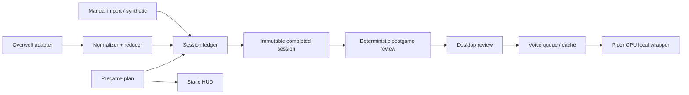

# TFT Windows - Xia agent port implementation plan

## Overview

Đặc tả triển khai từ [roadmap](../260923-1348-windows-personal-roadmap/plan.md), dùng **ck:xia → ck:plan**. Đã inspect source pin SHA của 4 upstream repo, map local integration và challenge trade-offs. Đây là **plan-only**, chưa implement, install, gọi provider hay triển khai Windows.

Mục tiêu đã xác nhận: cá nhân, Windows11/i5-12400F/16GB/RTX2060 6GB, ổn định và nhắc ít nhưng đúng. Baseline đề xuất theo roadmap: người dùng chọn plan trước trận → HUD tĩnh suốt trận → review có bằng chứng + tiếng Việt sau trận. Live adaptive, augment feed, OCR và scouting không nằm trong MVP. Jev tùy chọn, mặc định tắt; CPU/cache TTS trước, CUDA không là prerequisite. Đề xuất scope trong plan không phải xác nhận quyền nền tảng hay cho phép provider trả phí.

## Đọc theo thứ tự

1. [Source manifest + port inventory](./source-manifest.md): repo/ref/SHA, source → target, giữ/bỏ/viết lại, license/dependency.
2. [Challenge và decision matrix](../reports/260923-1401-xia-source-analysis/challenge-decisions.md): 12 câu phản biện; risk medium với3 critical gates.
3. [Contracts v1](./contracts.md): schema, API exports, session/voice cancellation, UI messages, bootstrap và semantics lỗi; chuẩn dùng chung.
4. Phase được giao bên dưới + [acceptance matrix](./acceptance-tests.md).
5. [Agent handoff](./agent-handoff.md): ownership, prompts và điều kiện dừng.

## Kiến trúc đích

Không có đường từ live reducer tới HUD tactical/voice. Desktop tồn tại ngoài trận, background là controller duy nhất. Browser không chứa key/provider SDK. Root runtime không phụ thuộc Jev; optional Node service chỉ thêm khi packet riêng được giao.

## Kế hoạch ghép và ước lượng

`P1 → {P2 ∥ P3 ∥ P4-baseline} → P5 → P6`. Phần core có thể làm bằng fixtures khi thiếu Windows; capture/voice acceptance vẫn pending. P1 phải kiểm shell/GEP/bootstrap và artifact availability sớm, không để tới P6 mới phát hiện kiến trúc không chạy. P6 là nghiệm thu tích hợp và pilot.

Ước lượng điều chỉnh **14–20 ngày công tập trung** cho baseline; với agent song song critical path khoảng9–13 ngày làm việc, chưa tính chờ quyền/thiết bị/pilot. P1:1–2d, P2:3–4d, P3:2–3d, P4:3–4d, P5:3–4d, P6:2–3d; tổng tuần tự14–20d. Jev thêm1–2d coding/fake tests và riêng một đợt benchmark khi được phép, không chặn MVP. Đây là estimate, không lời hứa ngày giao.

Phạm vi chi tiết nhiều file hơn prototype vì cần tách pure core, Windows boundary và test; không thêm framework UI, database hay port Rust stack. Chỉ tích hợp thư viện engine/SDK thay vì sao chép nguyên upstream.

## Phases

| Phase | Name | Status |
|-------|------|--------|
| 1 | [Contracts and source gates](./phase-01-contracts-and-source-gates.md) | Pending |
| 2 | [Event adapter and session ledger](./phase-02-event-adapter-and-session-ledger.md) | Pending |
| 3 | [Deterministic coaching and catalog](./phase-03-deterministic-coaching-and-catalog.md) | Pending |
| 4 | [Voice and optional Jev adapters](./phase-04-voice-and-optional-jev-adapters.md) | Pending |
| 5 | [Desktop HUD and application integration](./phase-05-desktop-hud-and-application-integration.md) | Pending |
| 6 | [Windows packaging and acceptance](./phase-06-windows-packaging-and-acceptance.md) | Pending |

## Dependencies

Plan này là backlog implementation chuẩn cho roadmap cũ. Roadmap giữ vai trò mục tiêu/đánh giá, **không chạy hai backlog trùng nhau**. `blocks` ở đây nghĩa roadmap được thực hiện thông qua plan chi tiết này, không tạo vòng dependency.

## Gates và rollback

- **P1/platform:** chứng minh load shell trên Windows, mode TFT, own-data feature availability và phạm vi được phép. Chưa có GEP → vẫn viết/test core bằng synthetic; fallback manual để dùng thật cần người dùng chọn. Shell không chạy → replan, không tự viết OCR.
- **P1/P4/artifact:** license/grant, wheel/version, model ONNX+JSON revision/hash chưa đủ thì không copy/phân phối hoặc nhận real TTS pass. Own-spec implementation vẫn tiến hành; có text review khi TTS unavailable.
- **P4/P6/service:** bindloopback, session secret, HMAC identity, exactOrigin, ownedPID và bounded queues. Không nới auth để demo.
- **Optional Jev:** cần assignment riêng và provider authorization trước request thật; fake transport không cần provider.
- Rollback từng packet theo phase; disable capture/voice/Jev trước, giữ sanitized export; phục hồi app+runtime+model theo artifact version đã kiểm. Không phục hồi prototype cũ rồi bật mock/live và gọi stable. Không tự git reset hay kill process của người dùng.

## Definition of done

- [ ] P1–P5 contract/integration suites pass, source provenance + third-party inventory đầy đủ.
- [ ] Các acceptance ID trong phạm vi có evidence; skipped được ghi riêng.
- [ ] Windows5trận pilot, audio20câu, quality30cases đạt hoặc scope giảm được người dùng chọn.
- [ ] Offline, relaunch, occupiedport, corruptmodel, mute/newmatch và rollback đã kiểm trên Windows.
- [ ] Không runtime mock-success/liveadaptive/paidcalls vô ý; không claim tăngrank hoặc Vanguard-safe100%.

## Review trước bàn giao

[Biên bản phản biện và kiểm tra tài liệu](./reports/from-reviewers-to-planner-contract-and-windows-validation.md). Tất cả phase pending là trạng thái implementation, không có nghĩa plan chưa được viết. Các lệnh test trong plan là việc coding agents sẽ làm; lượt này chỉ kiểm cấu trúc tài liệu/source mapping.
